# CORS-based Classification and Detection of Camouflaged Soldiers
Classification and Detection of Camouflaged Soldiers Using CORS-Based Ensemble Models with Augmented Data

## Goal
- 300장의 위장 군인 데이터로 1500장의 합성 데이터 생성
- 생성 데이터를 포함한 데이터셋으로 Classification ensemble model을 학습
- Classification과 Object Detection의 상호보완(CORS)을 제안
- 제안한 알고리즘으로 위장 군인 탐지 및 식별

## Problem & Solution
- 현실에서는 국방 데이터가 많이 부족
- 생성 모델을 통해서 부족한 데이터에 대한 문제를 해결
- 적은 데이터로 많은 데이터를 만들 수 있는 모델 탐색

## Task
- 약 300장의 실제 이미지로 약 1500장의 생성 이미지 생성
- 생성 이미지 절반은 적록 색맹 적용(750장)
- 생성된 이미지로 Classification ensemble model 학습
- 제안한 __상호보완 객체 인식 시스템(Complementary Object Recognition System, CORS)__으로 결과 향상

## Utilization Strategies
- 비무장 지대 혹은 전쟁 중 산악 지형에서 유용하게 사용될 수 있을 것
- 경계 감시 군인들의 피로를 줄일 수 있음
- 전차 카메라에 활용하여 매복병 탐지
- 다른 위장 및 매복 데이터 셋에서 활용 가능

### Class Image

  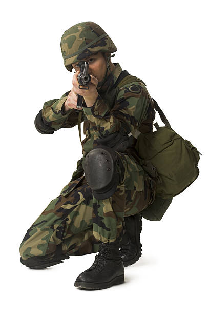
  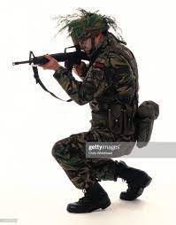
  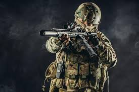
  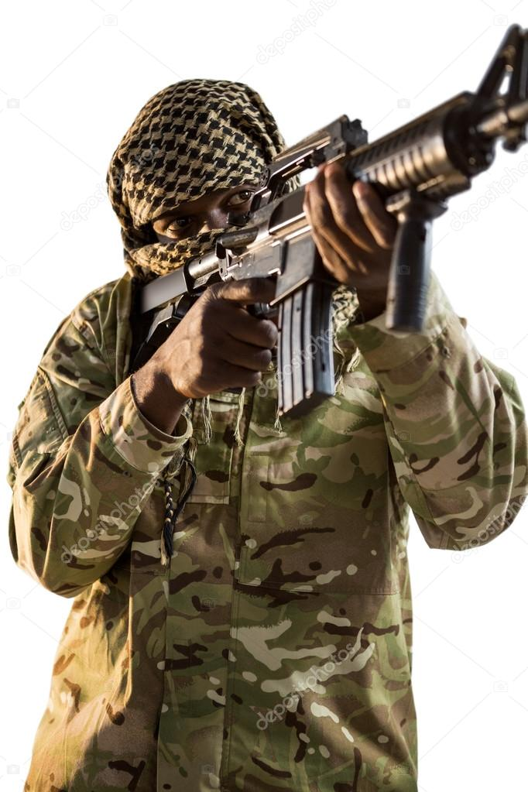

### Data Image

  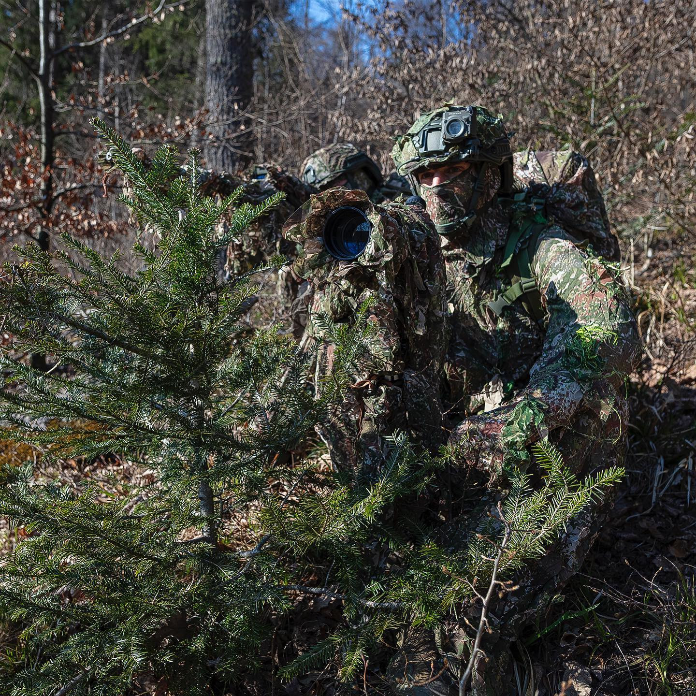
  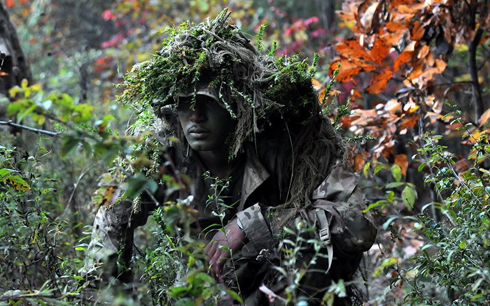
  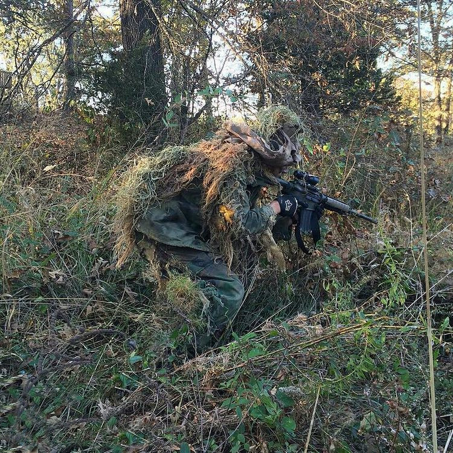
  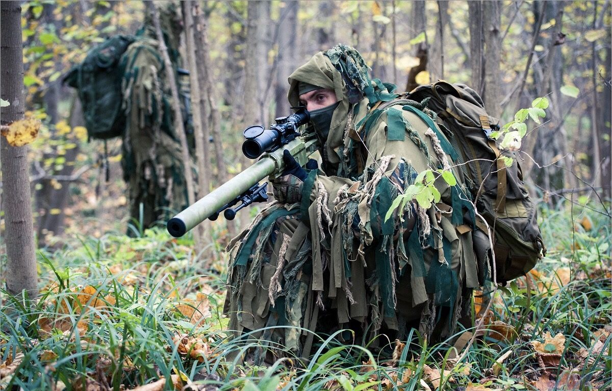

### Sampling Image

  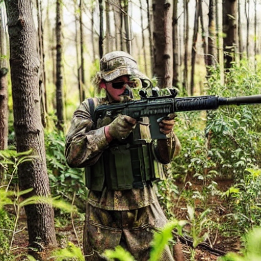
  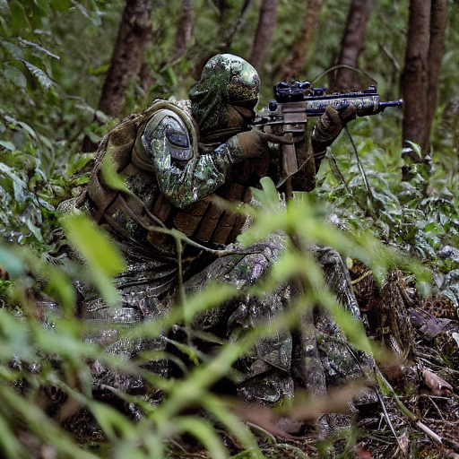
  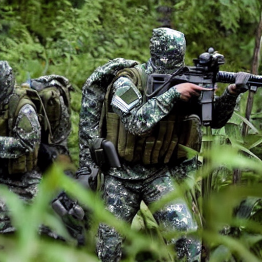
  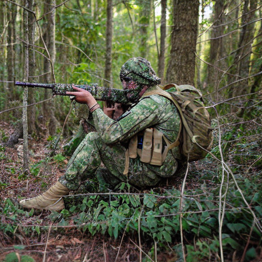

### Sampling with rg blindness

  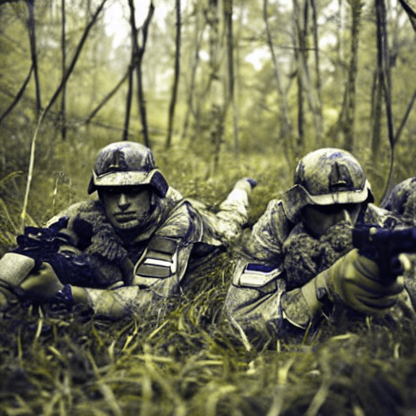
  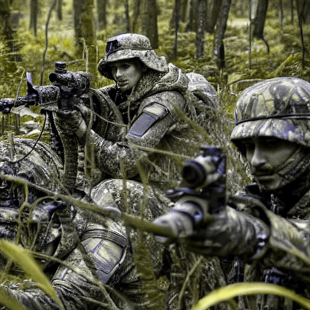
  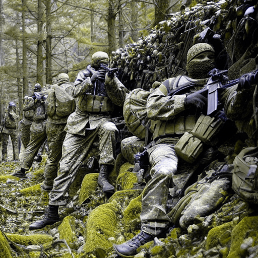
  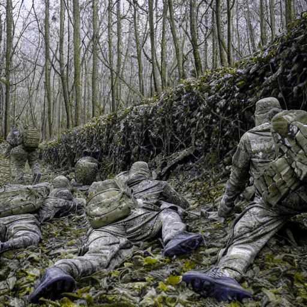

### Result loss and accuracy
| 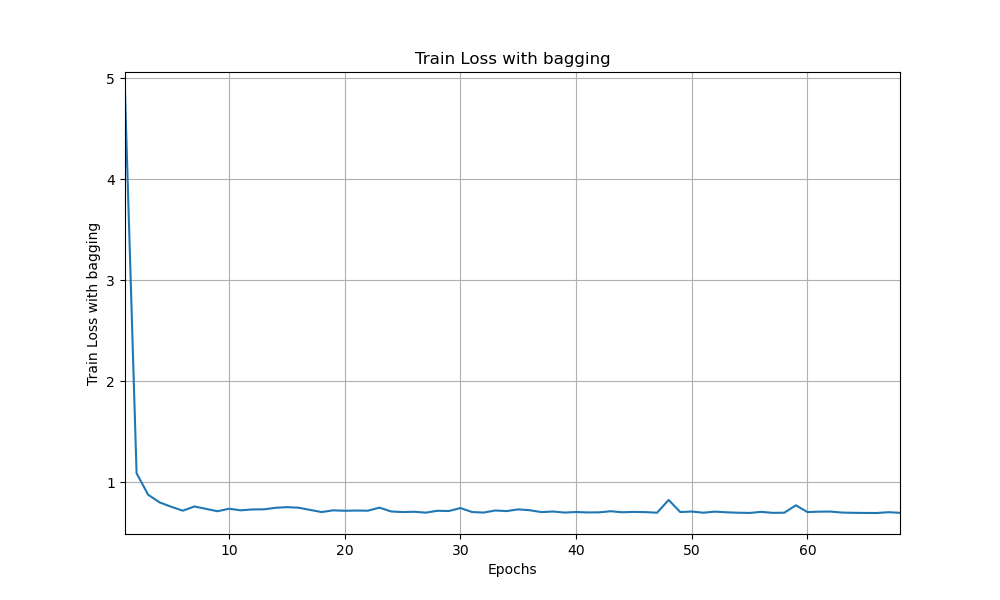 | 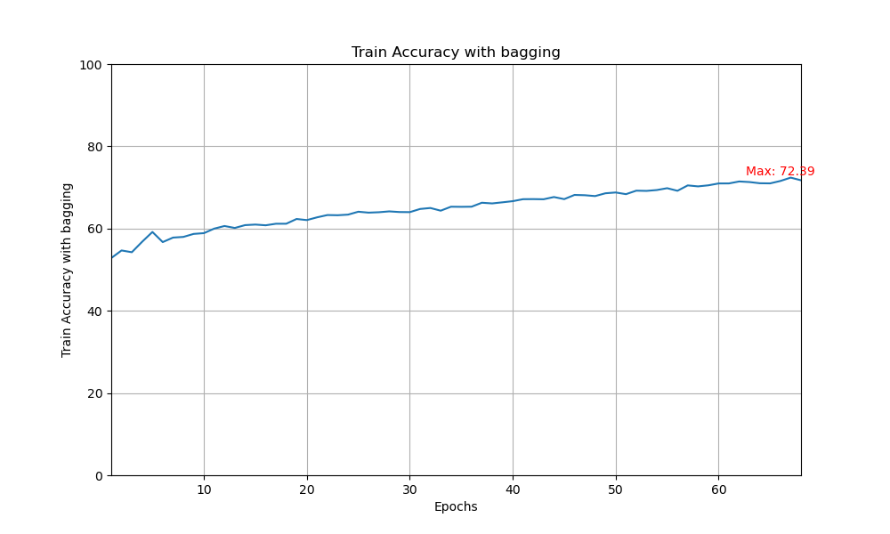 |
|:----------------------------------------------:|:--------------------------------------------------:|
| Train Loss                                      | Train Accuracy                                     |

| 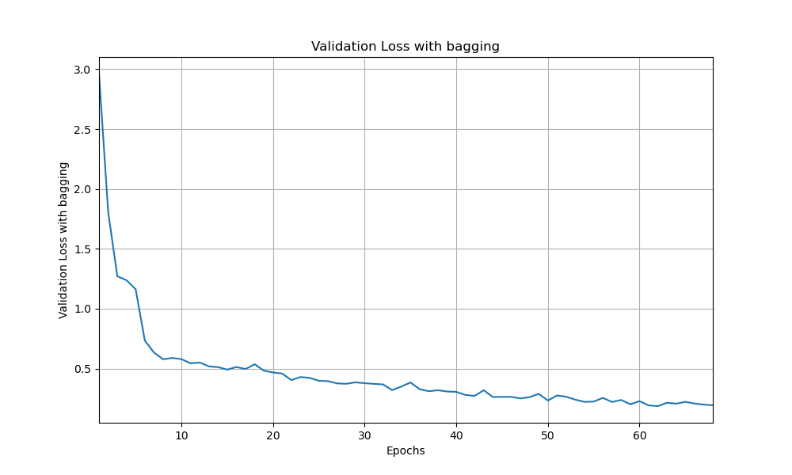 | 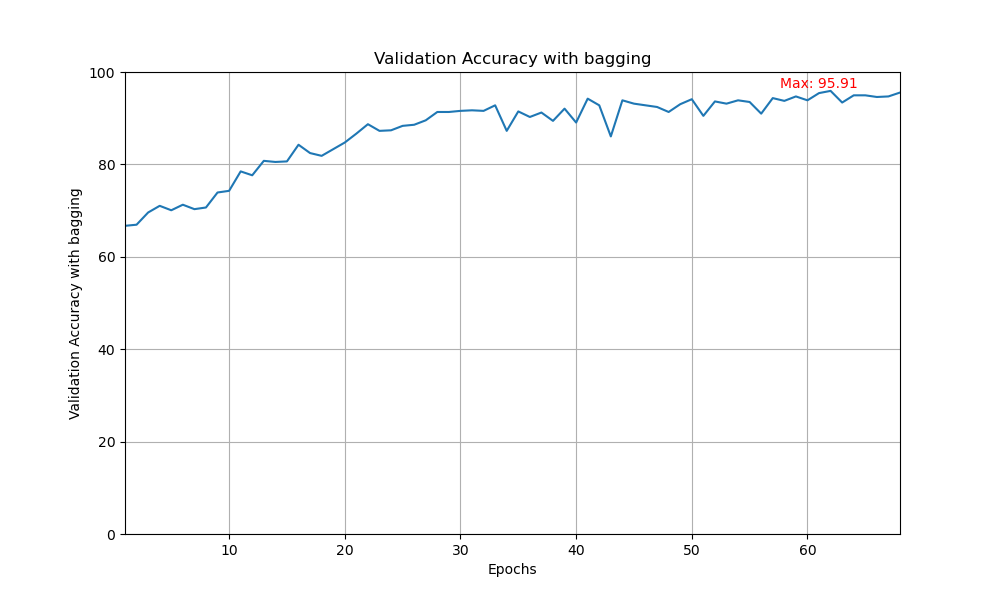 |
|:----------------------------------------------------:|:---------------------------------------------------------:|
| Validation Loss                                      | Validation Accuracy                                        |

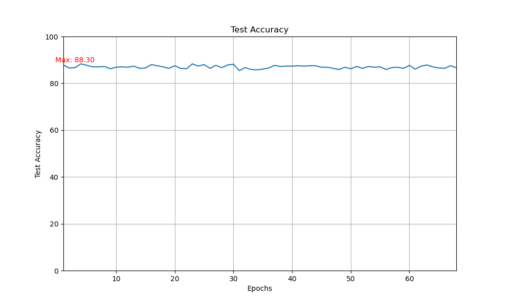

